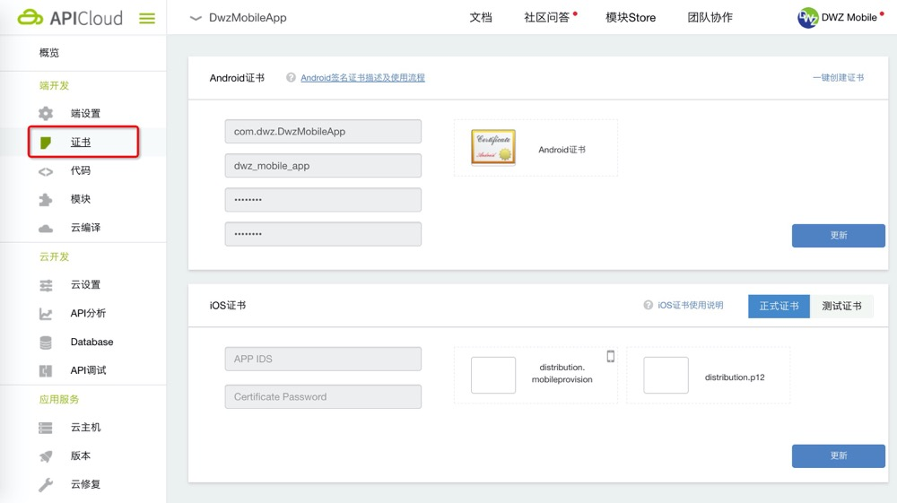
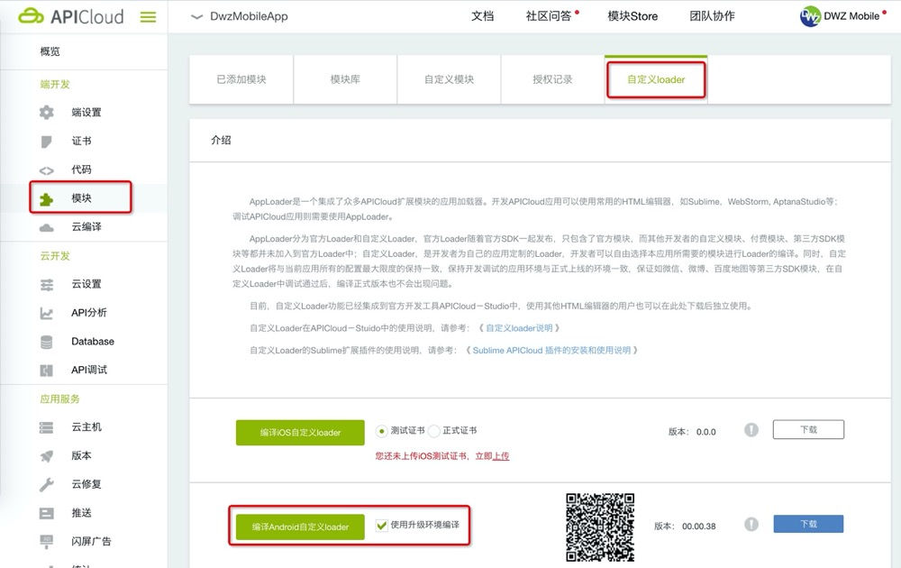
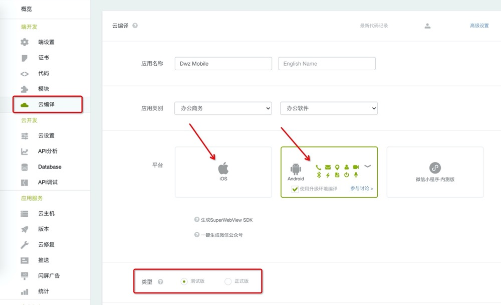
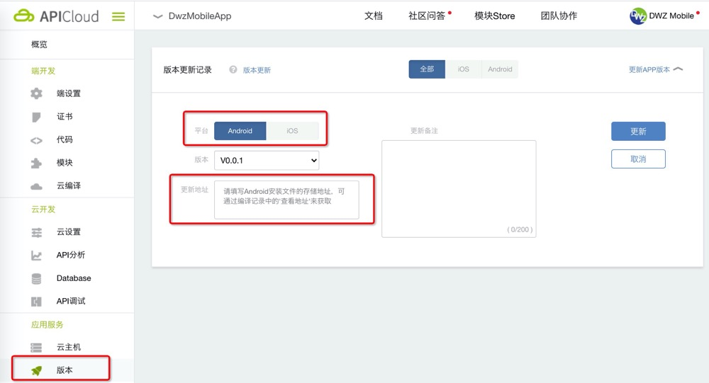

> ## 真机调试

1. 在 APICloud 控制台配制证书
   
2. APICloud【自定义 loader】打包（注意：iOS 打包需要配制测试证书）
   
3. 打包完成后，手机扫码下载安装 App
4. 项目根目录下，命令行执行 `npm run start`，控制台返回成功信息
   
5. 打开运行自定义 loader 打包的 App，点击旁边的圆形按钮，根据上一步返回的信息输入 IP 和端口号
   
6. 真机代码同步 `npm run sync`
7. 控制台查看真机运行日志 `npm run log`

> ## 云编译

1. 代码压缩混淆打包 `npm run build`
2. index.html 页面中 `loadScripts({env: 'dev'})` 改成 `loadScripts({env: 'build'})`
3. 提交代码
4. 云编译



> ## 发布和版本更新

1. 正式版打包后，下载安卓 apk 文件和 iOS ipa 文件
2. 安卓 apk 文件上传到自己服务器
3. iOS 需要在苹果开发者中心创建证书，并创建应用，然后再上传 ipa 文件

```
xcrun altool --validate-app -f dwz_mobile_app.ipa -t iOS --apiKey xxxxxxxx --apiIssuer xxxxxxxx-xxxx-xxxx-xxxx-xxxxxxxxxxxx --verbose
xcrun altool --upload-app -f dwz_mobile_app.ipa -t iOS --apiKey xxxxxxxxx --apiIssuer xxxxxxxx-xxxx-xxxx-xxxx-xxxxxxxxxxxx  --verbose
```

4. 在 apicloud 平台上 App 版本栏目下，更新安卓 apk 下载 url，和苹果 App 应用商店 url
   
5. [安装 mam 版本检测更新模块](/doc/apicloud/OtherModule?id=mam-模块)
