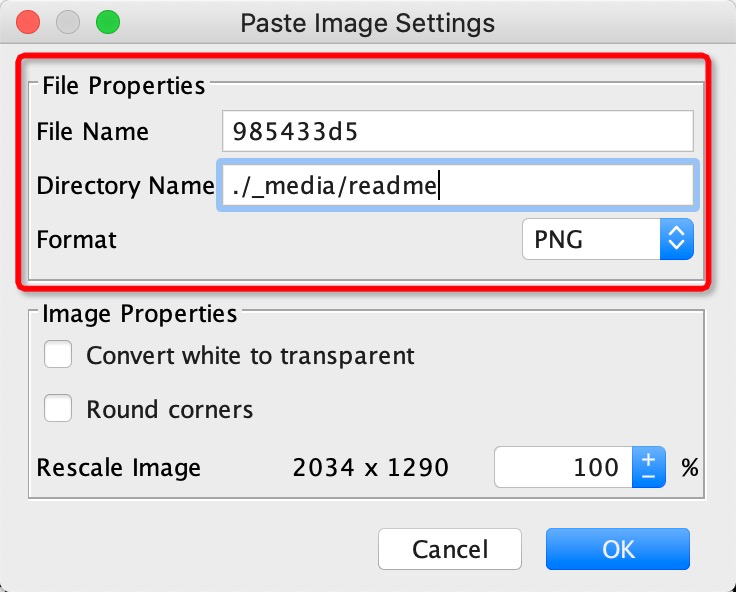
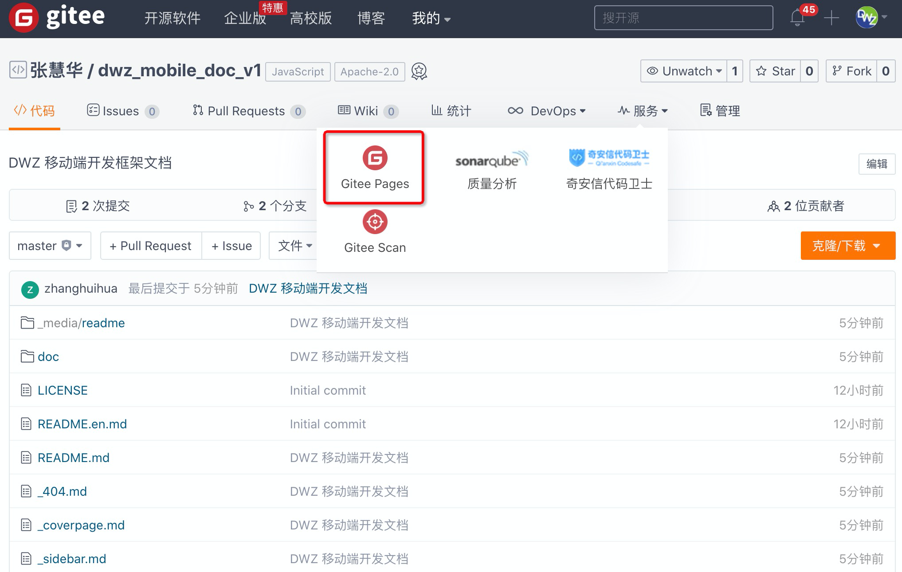
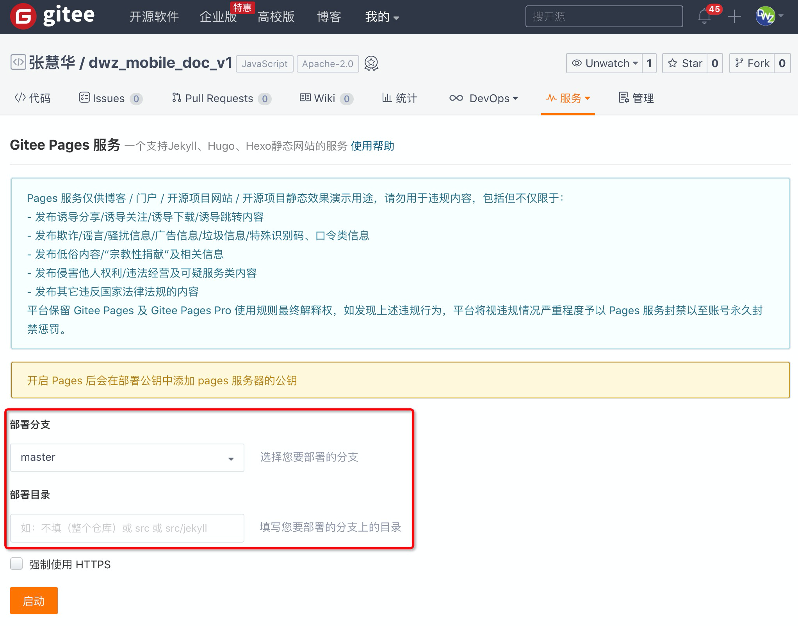

## 关于docsify
- [DWZ Mobile文档Markdown源文件](https://gitee.com/dwzteam/dwz_mobile_doc_v1)
- [DWZ Mobile在线文档](http://dwzteam.gitee.io/dwz_mobile_doc_v1)

> ### 快速使用

- 安装[docsify](https://docsify.js.org)
```bash
npm i docsify-cli -g
```
- 启动项目

进入项目根目录下，执行以下命令

```bash
npm run serve
```

当提示`Listening at http://localhost:3000`时，表示服务启动成功。

> ### 新增文档

`__sidebar.md`为导航栏，使用方法参考：[loadsidebar](https://docsify.js.org/#/zh-cn/configuration?id=loadsidebar)

- 让IDE的markdown编辑器支持上传图片

进入`File - Settings - Plugins`， 搜索`markdown`关键字， 安装 `Paste Image into Markdown` 插件


安装完成后重启IDE， 再次编辑`markdown`文件时，截图后直接在md文件中粘贴,会弹出如下弹窗：



理论上只需要修改目录即可， 文件名都是随机值，最终文件上传生成8位随机多件名+后缀png

> ### 部署文档

- 原生部署（类似启动，然后使用Nginx代理即可）
- Gitee Pages





上图两个地方使用默认配置即可

最后点击“更新”，等待大概1分钟，当出现`已开启 Gitee Pages 服务，网站地址： http://innodev_group.gitee.io/innodev-doc`则标识部署完成

> ### 参考
- 本文档使用[docsify](https://docsify.js.org)搭建，详情请查阅官方文档。
